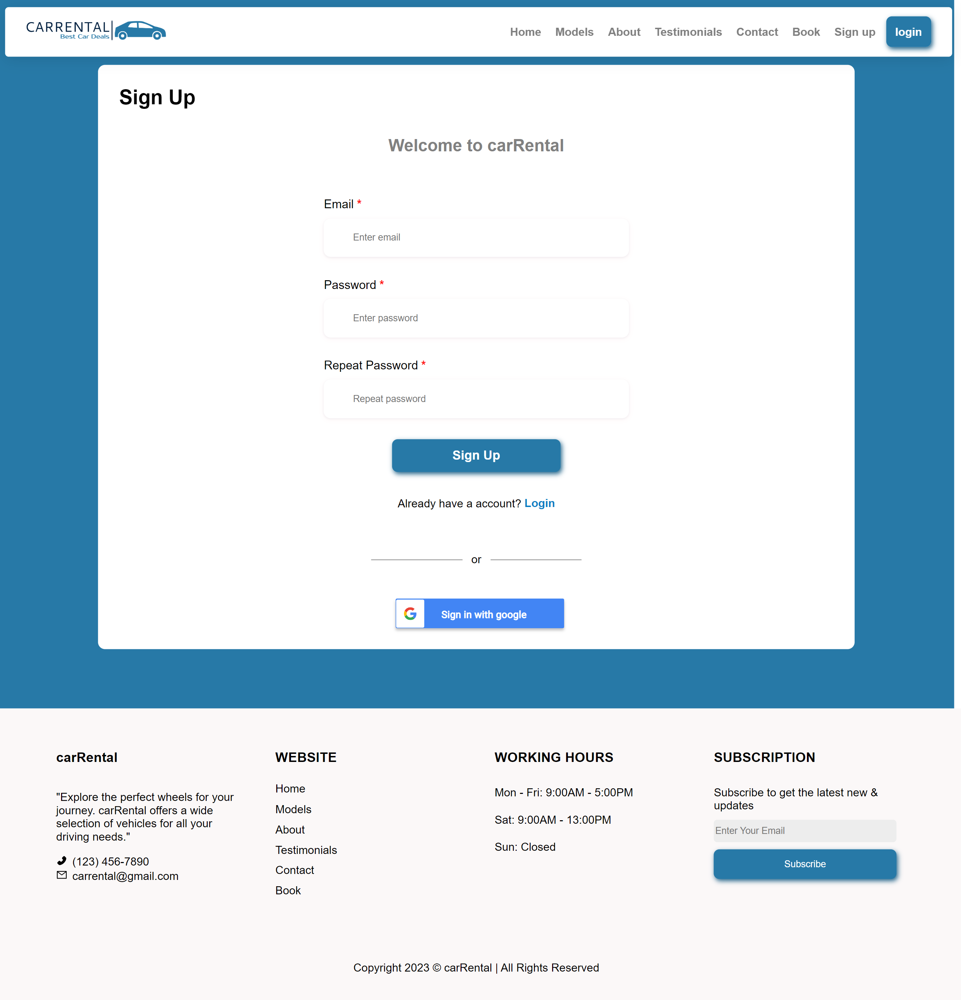

<h2>About the project</h2>
<b>carRental</b>
is an online platform that facilitates car rentals for personal or business purposes. Users can access the website through a secure login process, which provides them with an easy-to-navigate interface for comparing and reserving cars from a broad selection of vehicles with varying makes, models, sizes, and prices.

👉 Live Demo: <a href='https://car-rental-ten.vercel.app/'>Live Demo</a>

<h3>Build with:</h3>
  <h4>Deployment</h4>
  

  
  

  <h4>Frontend</h4>
  

  &nbsp;&nbsp;</a>&nbsp;&nbsp;
    &nbsp;&nbsp;</a>&nbsp;&nbsp;
  &nbsp;&nbsp;&nbsp;&nbsp;
  
  

  
  <h4>Backend</h4>
    

  <a href="https://firebase.google.com/">
  

<h2>Screenshots of the Project 📸</h2>
 
<h3 align='center'>Home Page 🏡</h3>

<h3 align='center'>Sign In Page 🚀</h3>

